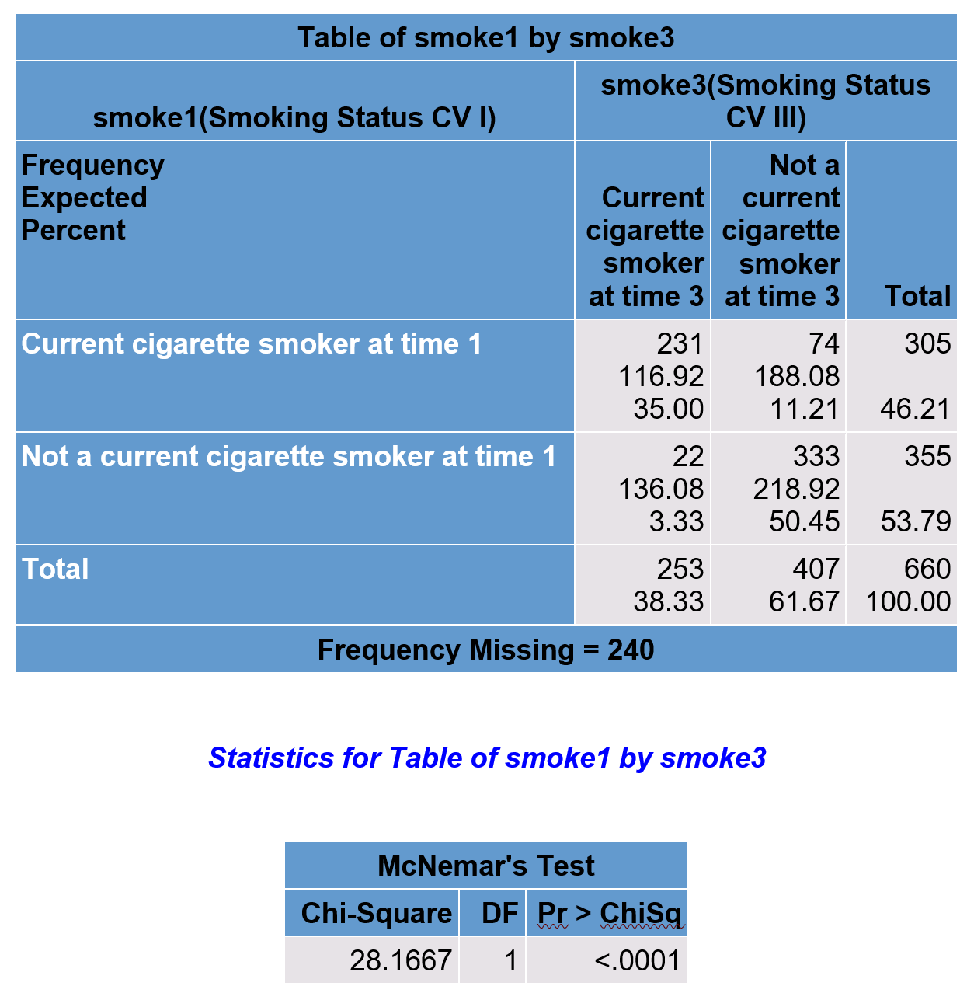
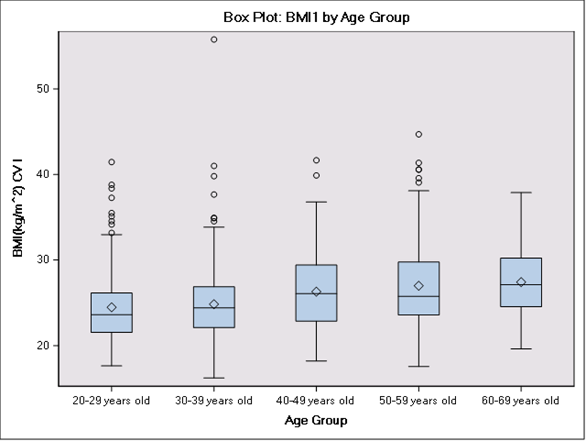
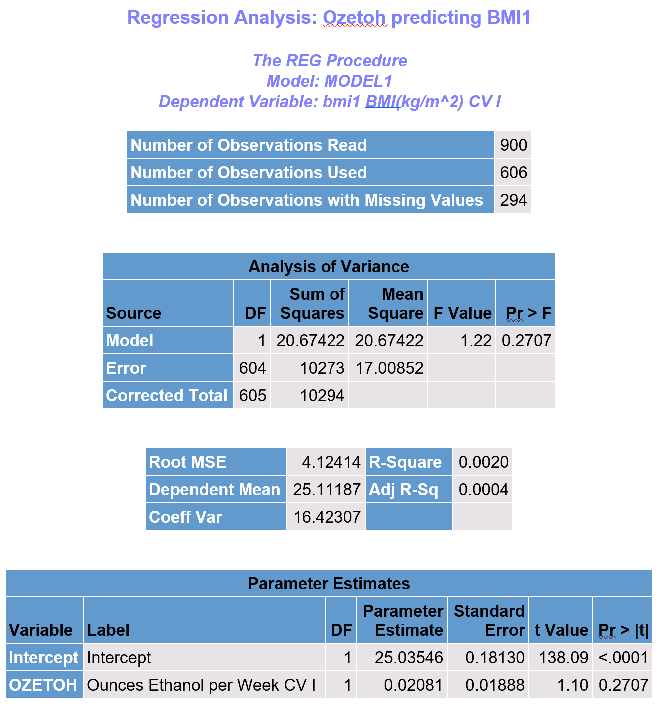
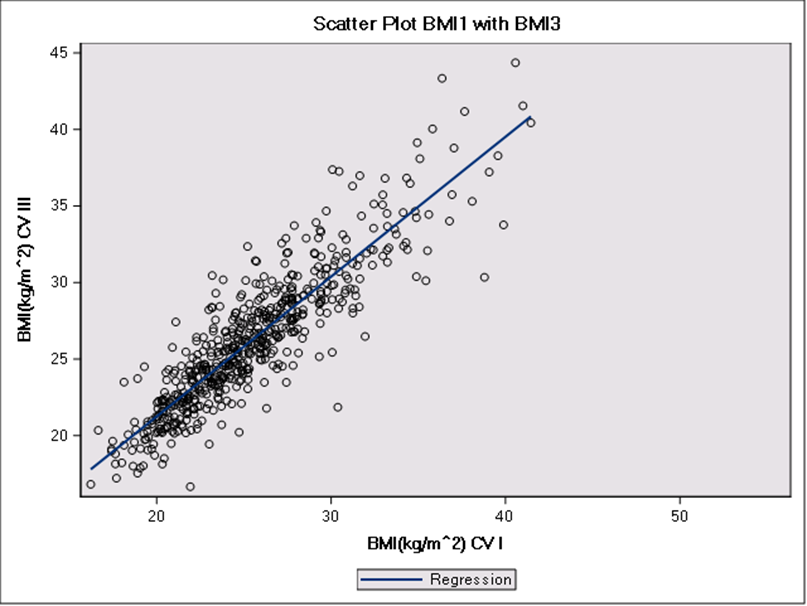

# Behavioral and Cardiometabolic Risk Factor Analysis Using SAS

## Summary

This project analyzes behavioral risk factors associated with cardiometabolic outcomes using epidemiological data to demonstrate applied biostatistical methods commonly used in public health research.

## Project Overview

This project uses SAS to perform an exploratory statistical analysis of behavioral and cardiometabolic risk factors using a stratified sample of the Tecumseh epidemiological dataset (N = 900). The analysis examines relationships between smoking behavior, alcohol consumption, age, sex, and body mass index (BMI) across two time points.

The goal is to demonstrate skills in data management, statistical analysis, and interpretation commonly used in public health and healthcare analytics.

------------------------------------------------------------------------

## Dataset

-   Source: Tecumseh epidemiological dataset (sampled using simple random sampling)
-   Sample size: N = 900
-   Key variables:
    -   Demographics: age, sex
    -   Behavioral factors: smoking status, alcohol consumption
    -   Clinical measures: height, weight, BMI (time 1 and time 3)

------------------------------------------------------------------------

## Tools & SAS Procedures Used

-   Data sampling: `PROC SURVEYSELECT`
-   Data transformation: DATA steps + `PROC FORMAT`
-   Descriptive statistics: `PROC MEANS`
-   Frequency analysis: `PROC FREQ`
-   Cross-tabulation & association testing:
    -   Chi-square tests
    -   Cochran-Armitage trend test
    -   McNemar’s test (paired categorical data)
-   Group comparisons:
    -   `PROC TTEST` (independent and paired samples)
    -   `PROC GLM` (ANOVA with Tukey post-hoc tests)
-   Correlation analysis: `PROC CORR`
-   Regression analysis: `PROC REG`
-   Data visualization: `PROC SGPLOT`, `PROC UNIVARIATE`

------------------------------------------------------------------------

## Key Findings

### Smoking Behavior

-   Smoking prevalence was significantly higher among males compared to females (p \< 0.0001).

-   Smoking status was significantly associated with both age group and alcohol consumption.

-   Smoking prevalence decreased significantly between time 1 and time 3 (McNemar’s test, p \< 0.0001).

    

    *Figure 1: This frequency table cross-tabulates smokers at time 1 and time 3, and McNemar's test allows us to compare this paired data to display a staitstically significant change in smoking status over time.*

------------------------------------------------------------------------

### BMI and Demographic Factors

-   No statistically significant difference in BMI between males and females (p = 0.36).

-   BMI increased significantly across age groups (ANOVA, p \< 0.0001).

    

    *Figure 2: This boxplot displays BMI at time 1 by age group, showing a significnat difference in BMI between at least two age groups.*

-   Tukey post-hoc tests identified multiple significant differences between younger and older age groups.

------------------------------------------------------------------------

### Alcohol Consumption and BMI

-   Alcohol consumption was not a significant predictor of BMI (p = 0.27).

-   Regression model explained very little variability in BMI (R² = 0.002), suggesting weak association.

    

    *Figure 3:* *Regression analysis predicting BMI (time 1) from alcohol consumption displays relevant parameter estimates and model fit statistics.*

------------------------------------------------------------------------

### BMI Over Time

-   Strong positive correlation between BMI at time 1 and time 3 (r = 0.89, p \< 0.0001).

-   Paired t-test showed a statistically significant increase in BMI over time (p \< 0.0001).

    

    *Figure 4: This scatter plot displays the strong positive correlation between BMI at time 1 (x-axis) and BMI at time 3 (y-axis).*

------------------------------------------------------------------------

## Key Insights

-   Behavioral risk factors (smoking and alcohol use) are strongly associated with demographic characteristics such as age and sex.
-   Age is a significant predictor of BMI, while alcohol consumption alone shows minimal predictive value.
-   Smoking prevalence declined over time in the study population.
-   BMI remains highly correlated over time but shows a small overall increase.

------------------------------------------------------------------------

## Repository Structure

``` text
smoking-risk-sas-analysis/
│
├── data/
│   └── tecumseh_etoh.sas7bdat
│
├── output/
│   └── (generated RTF files go here)
│
├── sas/
│   └── final_project.sas
│
└── README.md
```

------------------------------------------------------------------------

## Quick Start

**Setup**

-   Download or clone the repository

-   Open in SAS Studio or SAS OnDemand for Academics

-   Upload the full project folder into your SAS environment

Repository includes:

-   `sas/` → analysis code

-   `data/` → dataset required to run analysis

-   `output/` → generated results

**Run Analysis**

-   Open `sas/final_project.sas` in SAS Studio

<!-- -->

-   Click **Run (▶)**

<!-- -->

-   All data processing, analysis, and outputs execute automatically

**Output**

Results are saved to:

-   `output/hbaiyorprojectoutput.rtf`

To view:

-   Navigate to **Server Files and Folders**

-   Open `output/`

-   Download the RTF report

------------------------------------------------------------------------

## Skills Demonstrated

-   Epidemiologic analysis

-   SAS programming

-   Hypothesis testing

-   Regression modeling

-   Longitudinal comparison

## Author

Hannah Baiyor

MPH (Biostatistics), University of Nebraska Medical Center
